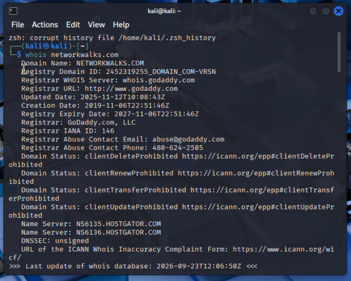
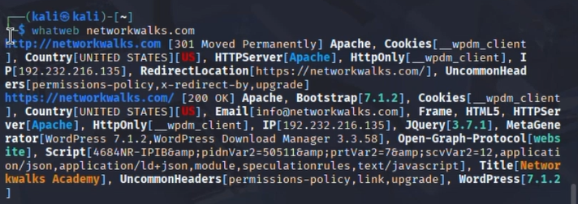
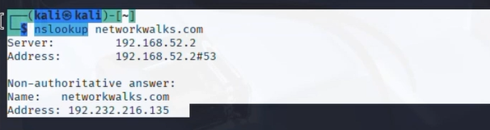
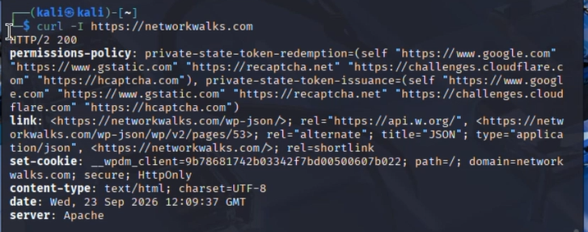
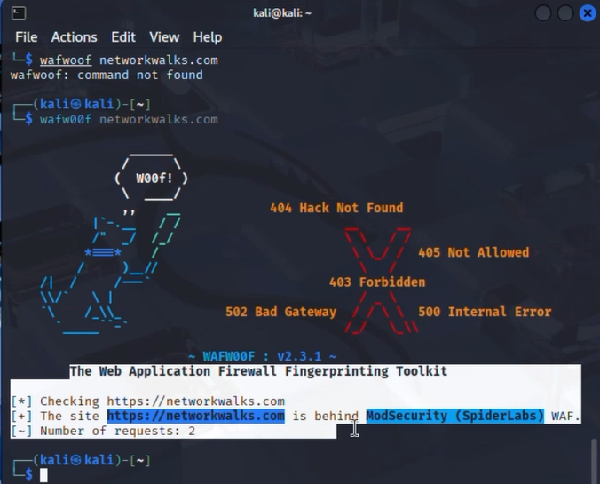
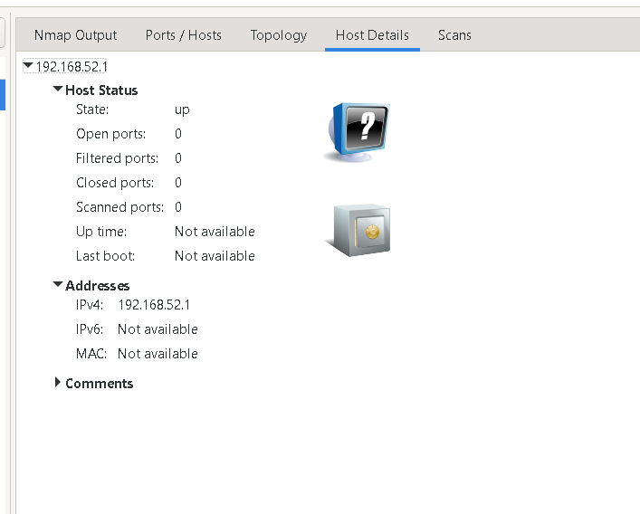

# Penetration Testing — Footprinting & Network Scanning

Week 2 practical for the Cybersecurity & Ethical Hacking internship at **Networkwalks**.
This module covers **footprinting/reconnaissance** against `networkwalks.com` (written
permission secured) and a **network scan** against a host on my own local network.

> ⚠️ **Disclaimer:** All activity here was performed only against systems I own or have
> explicit written permission to test. This repo is for education/research purposes only.
> Do not use any of this against systems you do not own or have authorization to test —
> unauthorized access is illegal in most countries.

## 📄 Report

The full write-up (methodology, evidence, risk analysis, recommendations) is in
[`Pentest_Report_Networkwalks.docx`](./Pentest_Report_Networkwalks.docx).

## 🧰 Tools Used

| Tool | Purpose |
|---|---|
| WHOIS | Domain registration details (registrar, dates, name servers) |
| WhatWeb | Web technology fingerprinting (CMS, plugins, server, IP) |
| Nslookup | Resolve the domain name to its IP address |
| curl -I | Inspect HTTP response headers |
| wafw00f | Detect the Web Application Firewall in front of the site |
| Nmap / Zenmap | Confirm a host is live on the local network |

## 🔍 Footprinting — `networkwalks.com`

```
$ whois networkwalks.com
$ whatweb networkwalks.com
$ nslookup networkwalks.com
$ curl -I https://networkwalks.com
$ wafw00f networkwalks.com
```

**Key findings:**
- Registered via GoDaddy.com, LLC — created 2019-11-06, expires 2027-11-06
- Name servers: `NS6135.HOSTGATOR.COM`, `NS6136.HOSTGATOR.COM`
- Resolves to `192.232.216.135`
- Running WordPress `7.1.2` with WordPress Download Manager `3.3.58`, Bootstrap `7.1.2`, jQuery `3.7.1`
- WordPress REST API endpoint (`/wp-json/`) exposed via response headers
- Protected by **ModSecurity (SpiderLabs)** WAF

**Evidence:**

| WHOIS | WhatWeb |
|---|---|
|  |  |

| Nslookup | curl -I |
|---|---|
|  |  |

**wafw00f:**



**Evidence:**

| WHOIS | WhatWeb |
|---|---|
|  |  |

| Nslookup | curl -I |
|---|---|
|  |  |

**wafw00f:**


## 🌐 Network Scanning — local host

```
$ nmap 192.168.52.1

Starting Nmap 7.991 ( https://nmap.org ) at 2026-09-23 20:02 +0500
Nmap scan report for 192.168.52.1
Host is up.
Nmap done: 1 IP address (1 host up) scanned in 0.83 seconds
```

Host `192.168.52.1` was confirmed **up**. This was a host-discovery (ping) check only —
no ports were scanned, so no service/MAC information was returned.




## ⚠️ Risk Summary

| Finding | Risk Level |
|---|:---:|
| Web technology information exposed (WordPress/plugin versions) | 🟠 Medium |
| Server IP address identifiable | 🟢 Low |
| HTTP technical information exposed (`/wp-json/`) | 🟢 Low |
| WAF technology identifiable (ModSecurity) | 🟢 Low |
| Domain registration infrastructure exposed | 🟢 Low |
| Live host confirmed on local network | 🟢 Low |

*These are observations from information-gathering activities, not confirmed
vulnerabilities — no exploitation was performed.*

## ✅ Recommendations

- Regularly review exposed web technology/version information
- Keep CMS, plugins and other software up to date
- Review HTTP headers for unnecessary technical disclosure
- Keep registrar privacy protection enabled and review DNS/name-server config
- Keep the WAF enabled and properly tuned
- Perform regular internal network discovery and a full authorized port/service scan
- Always operate within an authorized testing scope

---
**Program:** Cybersecurity program at Networkwalks | **Week:** 02
